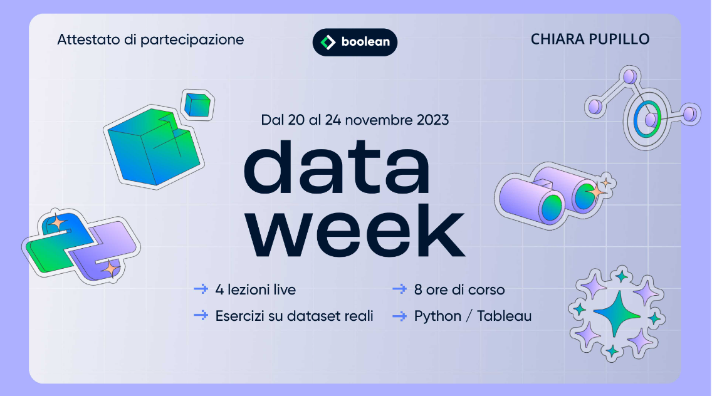

### 📅 Conferences
2024
- **27th Annual CyberPsychology, CyberTherapy & Social Networking Conference (CYPSY27)** - Arizona, USA (Remote)  
  *Role*: Presenter  
  *Presentation*: "Exploring the Relaxing Effects of Hallucinatory Simulated Experiences in Virtual Reality: A Pilot Study. Annual Cyberpsychology, Cybertherapy and Social Networking Conference"
- **Milan Workshop on Computational Methods for Mental Health and Well Being** - University of Milano-Bicocca, Milan, Italy

### ☀️❄️ Schools
- **PhD in AI & Society** - University of Pisa, Capo Vaticano, 23-30/06/2024  
- [**Data-Driven Healthcare Transformation - Learning Health System**](https://app.myopenbadge.com/receive/iCQS-86d7c844dfb7dec622bc72c0506795d6-IKEy-61724756715/uwaPhVHtzDBg-0f77bcc0f6500045859c7fd16cb8da48-epXtOSGR8BUl-5/public) - University of Pavia, Pavia, 19-23/02/2024  

### 🏆 Open Badges
- **Fastweb Digital Academy - Intelligenza Artificiale e lavoro: impatti, sfide e opportunità** 
- **Fastweb Digital Academy - Prompt engineering: l’arte di interrogare i chatbot** 
- [**Humane Intelligence. Trasformare l’Intelligenza Artificiale in una Tecnologia Positiva**](https://app.myopenbadge.com/receive/FGWujLb-0e643e4e284095075def3c3ebe5eb3a8-u5yxt38PNE7-31716830907/WGyaYXQHdkUi-43cf9a52926e0c9b4f1fbb6e051568fd-FmLM4giDl3-7/public)
- **Boolean - Data Week 2023** 
Python, Tableau

